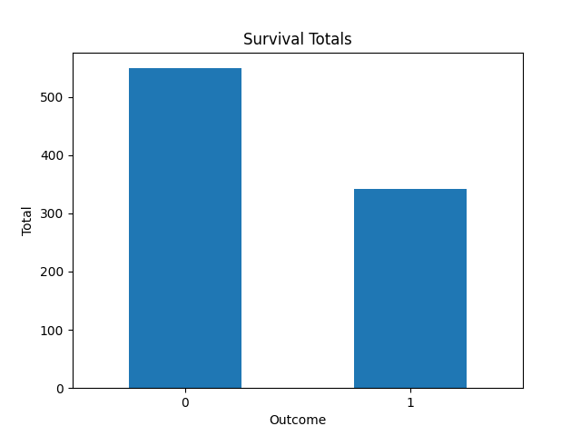
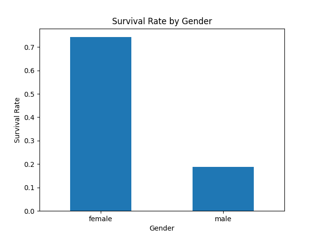
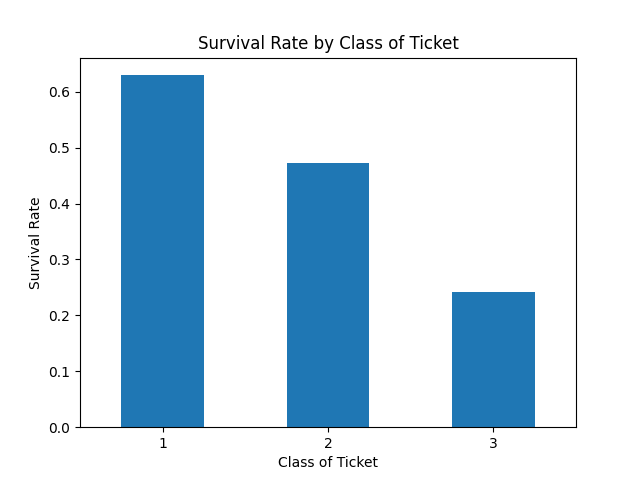

# Titanic Survival Predictions Using Machine Learning

In this project, we take a sample of over 800 passengers on the Titanic (`train.csv`), including their age, gender, class of ticket, and whether or not they survived. We also take a different sample of over 400 passengers (`test.csv`), with the same data provided, except for whether or not they survived. We apply logistic regression, a machine learning method, to the data in `train.csv` to predict survival outcomes for passengers in `test.csv`. Both datasets are provided as CSV files, which we convert into `pandas` dataframes for data cleaning and then to inform our predictions.

## Exploratory Data Analysis

The following bar plots show survival totals, survival rates by gender, and survival rates by class of ticket.

    
    
    

## Methodology

I chose logistic regression as an initial model since it is a relatively simple machine learning method suitable for binary classification tasks. I also chose to keep the feature engineering simple to focus on building a clean baseline model. No hyperparameter tuning was carried out and only a small number of raw features were used, however I intend to build upon this foundation.

## Validation

We use repeated stratified K-fold cross-validation to evaluate our model by randomly dividing the training data into 5 groups, where each group has the same survival rate as the full training data. For each one of these groups, we train our model on the remaining 4 groups to derive predictions for the specified group. We then see how accurately the model predicted survival in the specified group. We repeat this process across all 5 groups, and repeat the entire cycle 10 times, yielding a sample of 50 accuracy scores. This sample has mean 80% (±3%), indicating that the model provides non-trivial insights. 

## Results

Once complete, the program creates a new CSV file (`predictions.csv`) with predictions for whether they survived (1) or died (0). Via submission to Kaggle, I can confirm that the model achieved an accuracy of 0.76076 (76%) for predictions on the test set `test.csv`, which is broadly consistent with the cross-validation estimate of 0.80 ± 0.03. 

## Scope for further development

More powerful models will likely yield more accurate predictions. More intensive feature engineering, such as extracting titles from the 'Name' columns, could yield further insights. This project serves as a foundation for more advanced modelling work in the near future. 

## Skills demonstrated 

This project demonstrates skills in implementing industry-standard tools in Python, in particular the `pandas` library for using dataframes, and some tools from `scikit-learn`. I have trained and validated a machine learning model using appropriate statistical methods, and generated predictions presented in an appropriate format for further use and reporting. I am committed to rapidly developing my skills in these areas in the coming weeks and months.

## Acknowledgements

The datasets and inspiration for the project came from the Kaggle competition [Titanic - Machine Learning from Disaster](https://www.kaggle.com/competitions/titanic). Both datasets (`train.csv`, `test.csv`) are used here for non-commercial, educational purposes under their [competition rules](https://www.kaggle.com/competitions/titanic/rules#7-competition-data).
